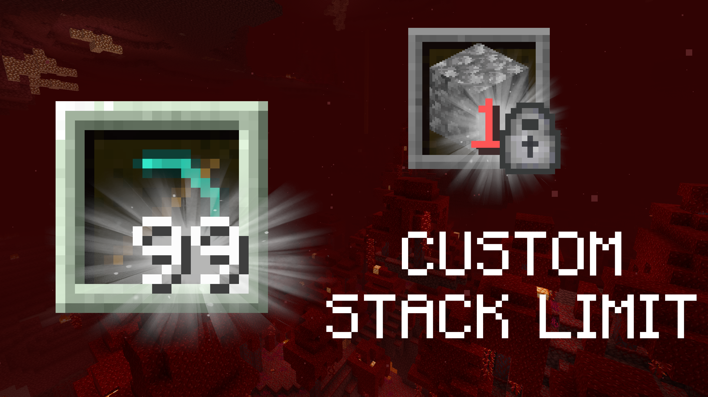

# Custom stack size data pack
A data pack which allows you to set custom stack sizes globally. Want to hold 99 stone pickaxes so they won't ever break? Done. Want to set all the stack sizes to 1 to challenge yourself? Done!

## Installation
- Download the data pack
  - From [Smithed.dev](https://smithed.dev/packs/custom-stack-size|128)
  - From [PlanetMinecraft](https://planetminecraft.com/data-packs/custom-stack-size-data-pack)
  - Obtain it from the [latest release on GitHub](https://github.com/AmericanBagel/custom-stack-size-data-pack/releases/latest)
  - Try out the latest changes (possibly breaking) by cloning the repository using the Code button at the top or using `git clone https://github.com/AmericanBagel/custom-stack-size-data-pack` on the command-line.
- [Install the data pack](https://minecraft.fandom.com/wiki/Tutorials/Installing_a_data_pack)

## Usage
Drop it into your world, `/reload` and enable it with `/datapack enable`, then run the following command:
```
/function ab.custom_stack_size:menu
```
Then just click the buttons to have a custom stack size!

## Contribution
If you have a suggestion, file an issue on GitHub or leave a comment on one of the platforms the pack is published on (listed above).

If you want to contribute any changes, make a pull request on GitHub. To get developing, you should be familiar with data packs, Python, and the the [Beet](https://github.com/mcbeet) ecosystem, including Beet, Mecha, and Bolt.
